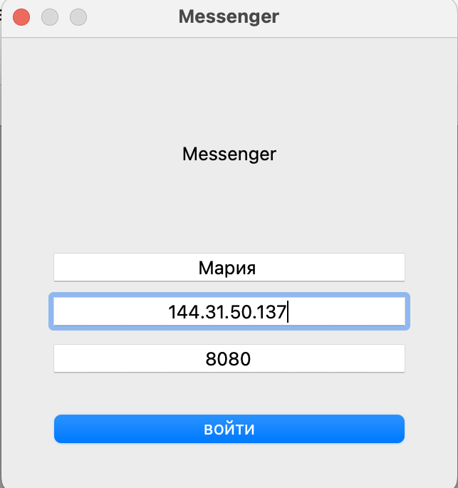
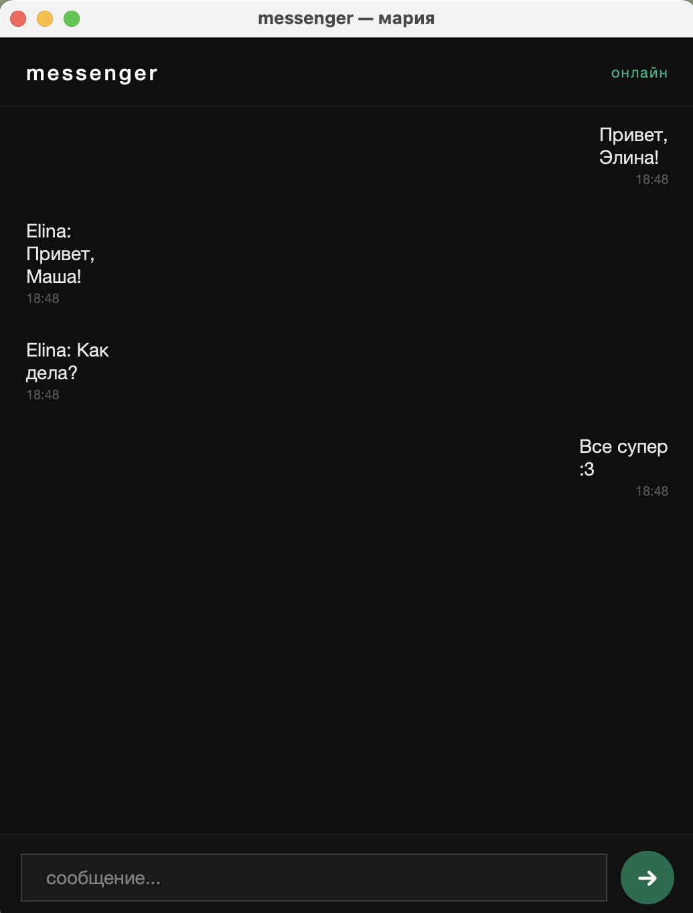

# Messenger

Мессенджер на C++17 с графическим интерфейсом на Qt и шифрованием сообщений с использованием библиотеки libsodium.

## Назначение

Программа позволяет двум пользователям обмениваться сообщениями через TCP-сервер. Передача сообщений осуществляется в зашифрованном виде с использованием алгоритмов библиотеки libsodium.

## Основные возможности

* подключение к удалённому серверу;
* обмен сообщениями в реальном времени;
* сквозное шифрование сообщений (End-to-End Encryption);
* графический интерфейс на Qt;
* модульное тестирование с помощью Doctest;
* автоматическая документация Doxygen.

## Структура проекта

* `Crypto` — генерация ключей, шифрование и расшифровка сообщений;
* `Packet` — передача пакетов по сети;
* `TcpClient` — клиентская часть;
* `TcpServer` — серверная часть;
* `ChatClient` — адаптер между сетевой частью и Qt;
* `ConnectDialog` — окно подключения;
* `MainWindow` — главное окно приложения.

## Требования

* C++17-совместимый компилятор;
* CMake 3.16 или новее;
* vcpkg (зависимости libsodium, doctest, Qt6 устанавливаются автоматически).

## Установка и сборка

### macOS

#### 1. Установить Homebrew

```bash
/bin/bash -c "$(curl -fsSL https://raw.githubusercontent.com/Homebrew/install/HEAD/install.sh)"
```

#### 2. Установить зависимости для сборки

```bash
brew install autoconf autoconf-archive automake libtool make
```

#### 3. Клонировать и собрать vcpkg

```bash
git clone https://github.com/microsoft/vcpkg.git ~/vcpkg
~/vcpkg/bootstrap-vcpkg.sh
```

#### 4. Задать переменные окружения

```bash
export VCPKG_ROOT=~/vcpkg
export PATH="/opt/homebrew/opt/make/libexec/gnubin:$PATH"
```

#### 5. Клонировать репозиторий

```bash
git clone https://github.com/mamuraveva/messenger.git
cd messenger
```

#### 6. Собрать проект

```bash
cmake --preset vcpkg
cmake --build build
```

### Ubuntu / Debian

#### 1. Установить зависимости

```bash
sudo apt install cmake g++ pkg-config libsodium-dev
```

#### 2. Клонировать репозиторий

```bash
git clone https://github.com/mamuraveva/messenger.git
cd messenger
```

#### 3. Собрать проект

```bash
cmake -B build
cmake --build build
```

## Запуск

### Сервер

```bash
./build/server 8080
```

Для запуска на VPS рекомендуется использовать tmux:

```bash
tmux new -s messenger
./build/server 8080
```

Отсоединиться без остановки сервера:

```text
Ctrl+B, затем D
```

Вернуться в сессию:

```bash
tmux attach -t messenger
```

### Клиент

```bash
./build/messenger_gui
```

После запуска:

1. Ввести имя пользователя.
2. Указать IP-адрес сервера и порт.
3. Нажать «Подключиться».
4. Отправлять и получать зашифрованные сообщения.

## Скриншоты





## Тестирование

```bash
ctest --test-dir build
```

## Документация

Сгенерировать документацию:

```bash
doxygen Doxyfile
```

Открыть главную страницу:

```text
docs/html/index.html
```
## Возможные проблемы

### Не задана переменная VCPKG_ROOT

Ошибка:

```text
Could not find toolchain file:
scripts/buildsystems/vcpkg.cmake
```

Причина: не задана переменная окружения `VCPKG_ROOT`.

Решение:

```bash
export VCPKG_ROOT=~/vcpkg
```

После этого повторить конфигурацию проекта.

---

### Репозиторий уже существует

Ошибка:

```text
destination path 'messenger' already exists and is not an empty directory
```

Причина: папка проекта уже существует.

Решение:

Если репозиторий уже был клонирован:

```bash
cd messenger
git pull
```

Если требуется чистая установка:

```bash
rm -rf ~/messenger
git clone https://github.com/mamuraveva/messenger.git
```

---

### Ошибка подключения к GitHub

Ошибка:

```text
SSL connection timeout
SSL_ERROR_SYSCALL
```

Причина: нестабильное интернет-соединение.

Решение:

Повторить команду через несколько минут:

```bash
git clone https://github.com/mamuraveva/messenger.git
```

При необходимости использовать VPN.

---

### Конфликт старой сборки CMake

Ошибка:

```text
Specify a unique binary directory name
```

Причина: в проекте остались файлы предыдущей сборки.

Решение:

```bash
rm -rf build
rm -rf gui/build
```

После этого выполнить сборку заново:

```bash
cmake --preset vcpkg
cmake --build build
```

---

### Ошибка подключения клиента к серверу

Ошибка:

```text
Ошибка установки зашифрованного соединения
```

Возможные причины:

- сервер не запущен;
- указан неверный IP-адрес;
- указан неверный порт;
- подключён только один клиент.

Проверить запуск сервера:

```bash
./build/server 8080
```

Для тестирования локально можно запустить сервер и два клиента на одной машине:

```text
IP: 127.0.0.1
Порт: 8080
```
## Автор

Мария Муравьёва

